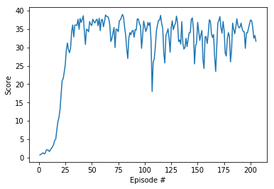

# Continuous Control

---

You are welcome to use this coding environment to train your agent for the project.  Follow the instructions below to get started!

### 1. Start the Environment

Run the next code cell to install a few packages.  This line will take a few minutes to run!


```python
!pip -q install ./python
```

    tensorflow 1.7.1 has requirement numpy>=1.13.3, but you'll have numpy 1.12.1 which is incompatible.
    ipython 6.5.0 has requirement prompt-toolkit<2.0.0,>=1.0.15, but you'll have prompt-toolkit 3.0.5 which is incompatible.


The environments corresponding to both versions of the environment are already saved in the Workspace and can be accessed at the file paths provided below.  

Please select one of the two options below for loading the environment.


```python
from unityagents import UnityEnvironment
import numpy as np

def env_option(agent,port =5005):
    if(agent == "single_agent"):
        # select this option to load version 1 (with a single agent) of the environment
        return UnityEnvironment(file_name='/data/Reacher_One_Linux_NoVis/Reacher_One_Linux_NoVis.x86_64')
    else:
        # select this option to load version 2 (with 20 agents) of the environment
        return UnityEnvironment(file_name='/data/Reacher_Linux_NoVis/Reacher.x86_64')

env = env_option("multiple_agent")
#env = env_option("single_agent")
```

    INFO:unityagents:
    'Academy' started successfully!
    Unity Academy name: Academy
            Number of Brains: 1
            Number of External Brains : 1
            Lesson number : 0
            Reset Parameters :
    		goal_speed -> 1.0
    		goal_size -> 5.0
    Unity brain name: ReacherBrain
            Number of Visual Observations (per agent): 0
            Vector Observation space type: continuous
            Vector Observation space size (per agent): 33
            Number of stacked Vector Observation: 1
            Vector Action space type: continuous
            Vector Action space size (per agent): 4
            Vector Action descriptions: , , , 


Environments contain **_brains_** which are responsible for deciding the actions of their associated agents. Here we check for the first brain available, and set it as the default brain we will be controlling from Python.


```python
# get the default brain
def get_brain_name(env):
    brain_name = env.brain_names[0]
    brain = env.brains[brain_name]
    return brain_name,brain

brain_name,brain = get_brain_name(env)
```

### 2. Examine the State and Action Spaces

Run the code cell below to print some information about the environment.


```python
def examine_state_action_space(env,brain_name,brain):
    # reset the environment
    env_info = env.reset(train_mode=True)[brain_name]

    # number of agents
    num_agents = len(env_info.agents)
    print('Number of agents:', num_agents)

    # size of each action
    action_size = brain.vector_action_space_size
    print('Size of each action:', action_size)

    # examine the state space 
    states = env_info.vector_observations
    state_size = states.shape[1]
    print('There are {} agents. Each observes a state with length: {}'.format(states.shape[0], state_size))
    print('The state for the first agent looks like:', states[0])
    
    return num_agents,action_size,state_size
    
num_agents,action_size,state_size = examine_state_action_space(env, brain_name,brain)
```

    Number of agents: 20
    Size of each action: 4
    There are 20 agents. Each observes a state with length: 33
    The state for the first agent looks like: [  0.00000000e+00  -4.00000000e+00   0.00000000e+00   1.00000000e+00
      -0.00000000e+00  -0.00000000e+00  -4.37113883e-08   0.00000000e+00
       0.00000000e+00   0.00000000e+00   0.00000000e+00   0.00000000e+00
       0.00000000e+00   0.00000000e+00  -1.00000000e+01   0.00000000e+00
       1.00000000e+00  -0.00000000e+00  -0.00000000e+00  -4.37113883e-08
       0.00000000e+00   0.00000000e+00   0.00000000e+00   0.00000000e+00
       0.00000000e+00   0.00000000e+00   5.75471878e+00  -1.00000000e+00
       5.55726624e+00   0.00000000e+00   1.00000000e+00   0.00000000e+00
      -1.68164849e-01]


### 3. Take Random Actions in the Environment

In the next code cell, you will learn how to use the Python API to control the agent and receive feedback from the environment.

Note that **in this coding environment, you will not be able to watch the agents while they are training**, and you should set `train_mode=True` to restart the environment.


```python
env_info = env.reset(train_mode=True)[brain_name]      # reset the environment    
states = env_info.vector_observations                  # get the current state (for each agent)
scores = np.zeros(num_agents)                          # initialize the score (for each agent)
while True:
    actions = np.random.randn(num_agents, action_size) # select an action (for each agent)
    actions = np.clip(actions, -1, 1)                  # all actions between -1 and 1
    env_info = env.step(actions)[brain_name]           # send all actions to tne environment
    next_states = env_info.vector_observations         # get next state (for each agent)
    rewards = env_info.rewards                         # get reward (for each agent)
    dones = env_info.local_done                        # see if episode finished
    scores += env_info.rewards                         # update the score (for each agent)
    states = next_states                               # roll over states to next time step
    if np.any(dones):                                  # exit loop if episode finished
        break
print('Total score (averaged over agents) this episode: {}'.format(np.mean(scores)))
```

    Total score (averaged over agents) this episode: 0.13199999704957008


When finished, you can close the environment.

### 4. It's Your Turn!

Now it's your turn to train your own agent to solve the environment!  A few **important notes**:
- When training the environment, set `train_mode=True`, so that the line for resetting the environment looks like the following:
```python
env_info = env.reset(train_mode=True)[brain_name]
```
- To structure your work, you're welcome to work directly in this Jupyter notebook, or you might like to start over with a new file!  You can see the list of files in the workspace by clicking on **_Jupyter_** in the top left corner of the notebook.
- In this coding environment, you will not be able to watch the agents while they are training.  However, **_after training the agents_**, you can download the saved model weights to watch the agents on your own machine! 

### Algorithm
This notebook uses DDPG and firstly I tried with version 1 of the problem that is going with single agent however there were some minor changes needed as the same network should be able to run on multi-agent environment. Udaicty Pong code for DDPG was taken into account for ideas implemented in this project. So let us understand the algorithm and reason for different hyperparameters.

##### What is DDPG?
This algorithm part of the actor critic method where actor defines the policy and critic uses this policy to predict Q value function and tells the actor how good is the prediction with the current weights in neural architecture. Both actor and critic are based on neural networks. In training, Critic should be trained first and then actor should be trained on the modified critic model. This approach is closely connected to Q-learning, and is motivated the same way: if you know the optimal action-value function $Q^*(s,a)$, then in any given state, the optimal action $a*(s)$ can be found by solving

$$a^*(s) = \arg \max_a Q^*(s,a)$$.

DDPG interleaves learning an approximator to $Q^*(s,a)$ with learning an approximator to $a^*(s)$, and it does so in a way which is specifically adapted for environments with continuous action spaces. But what does it mean that DDPG is adapted specifically for environments with continuous action spaces? It relates to how we compute the max over actions in $max_a Q^*(s,a)$.

As DDPG uses Q learning, Replay Buffer is one important step duing implementation. For more details on DDPG please go to this [link](https://spinningup.openai.com/en/latest/algorithms/ddpg.html)

#### Network
I have used 3 layer neural network in both actor and critic. Actor Neural Network has 3 fully connected layer where first layer takes states as input and produces output of 128 which is fed into relu activation function to learn non-linearity. The ouput produced from previous step is put into another layer of (128,128) with relu as activation function. After this batch normalization to normalize the data and smoothening of data for faster training. The last layer in network takes previous layer output and produces action.I am using tanh as the activation function for value to range from -1 to 1.
Critic Neural Network is more of similar however there is concatenation of action with the first layer output as we have to criticize the action produced by neural network. Since Q value can range without any limitation there is no implementation of activation in the last layer.
    Two suggestions were explored and found to help in improving the network to some extent: Gradient Clipping and hard copy of weights to the target network.
    - Gradient Clipping - torch.nn.utils.clip_grad_norm(self.critic_local.parameters(), 1)
    - Hard Copy - target_param.data.copy_(param.data)
    
#### Hyper parameters
- BUFFER_SIZE = int(1e5)
- BATCH_SIZE = 128
- GAMMA = 0.99
- TAU = 1e-3
- LR_ACTOR = 1e-4
- LR_CRITIC = 1e-3
- WEIGHT_DECAY = 0

Some of these hyper paramters were taken from DDPG implementation in udacity and others are obtained through trials.
    


```python
import torch
import torch.nn as nn
import torch.nn.functional as F

def hidden_init(layer):
    fan_in = layer.weight.data.size()[0]
    lim = 1. / np.sqrt(fan_in)
    return (-lim, lim)

class Actor_NN(nn.Module):
    
    def __init__(self,input_size, output_size, seed = 0):
        super(Actor_NN,self).__init__()
        self.seed = torch.manual_seed(seed)
        self.fc0 = nn.Linear(input_size, 128)
        self.fc1 = nn.Linear(128,128)
        self.fc2 = nn.Linear(128,output_size)
        self.bn1 = nn.BatchNorm1d(128)
        self.reset_parameters()
        
    def reset_parameters(self):
        self.fc0.weight.data.uniform_(*hidden_init(self.fc0))
        self.fc1.weight.data.uniform_(*hidden_init(self.fc1))
        self.fc2.weight.data.uniform_(-3e-3, 3e-3)
    
    def forward(self,state):
        if state.dim() == 1:
            state = torch.unsqueeze(state,0)
        a = F.relu(self.fc0(state))
        a = F.relu(self.fc1(a))
        a = self.bn1(a)
        a = F.tanh(self.fc2(a))
        return a
    

class Critic_NN(nn.Module):
    
    def __init__(self,input_size,action_size, seed = 0):
        super(Critic_NN,self).__init__()
        self.seed = torch.manual_seed(seed)
        self.fc0 = nn.Linear(input_size, 128)
        self.fc1 = nn.Linear(128 + action_size,128)
        self.fc2 = nn.Linear(128,1)
        self.bn1 = nn.BatchNorm1d(128)
        self.reset_parameters()
        
    def reset_parameters(self):
        self.fc0.weight.data.uniform_(*hidden_init(self.fc0))
        self.fc1.weight.data.uniform_(*hidden_init(self.fc1))
        self.fc2.weight.data.uniform_(-3e-3, 3e-3)
    
    def forward(self,state, action):
        if state.dim() == 1:
            state = torch.unsqueeze(state,0)
        a = F.leaky_relu(self.fc0(state))
        a = self.bn1(a)
        a = torch.cat((a, action), dim=1)
        a = F.leaky_relu(self.fc1(a))
        return self.fc2(a)
   
```


```python
import random
import copy
from collections import namedtuple, deque

import numpy as np
import torch.optim as optim

BUFFER_SIZE = int(1e5)
BATCH_SIZE = 128
GAMMA = 0.99
TAU = 1e-3
LR_ACTOR = 1e-4
LR_CRITIC = 1e-3
WEIGHT_DECAY = 0

device = torch.device("cuda:0" if torch.cuda.is_available() else "cpu")
```


```python
class OUNoise():
    
    def __init__(self, size, seed, mu=0., theta=0.15, sigma=0.2):
        """Initialize parameters and noise process."""
        self.mu = mu * np.ones(size)
        self.theta = theta
        self.sigma = sigma
        self.seed = random.seed(seed)
        self.reset()

    def reset(self):
        """Reset the internal state (= noise) to mean (mu)."""
        self.state = copy.copy(self.mu)

    def sample(self):
        """Update internal state and return it as a noise sample."""
        x = self.state
        dx = self.theta * (self.mu - x) + self.sigma * (np.random.rand(*x.shape)-0.5)
        self.state = x + dx
        return self.state
```


```python
class ReplaceBuffer():
    
    def __init__(self, action_size, buffer_size, batch_size, seed):
        """Initialize a ReplayBuffer object."""
        self.action_size = action_size
        self.buffer_size = buffer_size
        self.batch_size = batch_size
        self.memory = deque(maxlen = buffer_size)
        self.experience = namedtuple("Experience", field_names = ['state', "action", "reward", "next_state","done"])
        self.seed = random.seed(seed)
        
    def add(self,state,action,reward,next_state,done):
        e = self.experience(state,action,reward,next_state,done)
        self.memory.append(e)
        
    def sample(self):
        experiences = random.sample(self.memory, k = self.batch_size)
        states = torch.from_numpy(np.vstack([e.state for e in experiences if e is not None])).float().to(device)
        actions = torch.from_numpy(np.vstack([e.action for e in experiences if e is not None])).float().to(device)
        rewards = torch.from_numpy(np.vstack([e.reward for e in experiences if e is not None])).float().to(device)
        next_states = torch.from_numpy(np.vstack([e.next_state for e in experiences if e is not None])).float().to(device)
        dones = torch.from_numpy(np.vstack([e.done for e in experiences if e is not None]).astype(np.uint8)).float().to(device)
        return (states, actions, rewards, next_states, dones)
    
    def __len__(self):
        return len(self.memory)
```


```python
class Agent():
    """Interacts with and learn from evironment"""
    def __init__(self, num_agents, state_size,action_size,random_seed):
        """Initialixe an Agent object"""
        self.state_size = state_size
        self.action_size = action_size
        self.seed = random.seed(random_seed)
        
        self.actor_local = Actor_NN(state_size, action_size,random_seed).to(device)
        self.actor_target = Actor_NN(state_size, action_size,random_seed).to(device)
        self.actor_optimizer = optim.Adam(self.actor_local.parameters(), lr = LR_ACTOR)

        self.critic_local = Critic_NN(state_size, action_size, random_seed).to(device)
        self.critic_target = Critic_NN(state_size, action_size, random_seed).to(device)
        self.critic_optimizer = optim.Adam(self.critic_local.parameters(), lr = LR_CRITIC,weight_decay=WEIGHT_DECAY)

        self.hard_copy_weights(self.actor_target, self.actor_local)
        self.hard_copy_weights(self.critic_target, self.critic_local)
        
        self.noise = OUNoise((num_agents,action_size), random_seed)
        
        self.memory = ReplaceBuffer(action_size, BUFFER_SIZE, BATCH_SIZE, random_seed)
    
    def hard_copy_weights(self, target, source):
        """ copy weights from source to target network (part of initialization)"""
        for target_param, param in zip(target.parameters(), source.parameters()):
            target_param.data.copy_(param.data)    
    
    def step(self,states,actions,rewards,next_states,dones):
        "Save experience and use random sample from buffer to learn"
        for state, action, reward, next_state, done in zip(states, actions, rewards, next_states, dones):
            self.memory.add(state,action,reward,next_state,done)
        if(len(self.memory) > BATCH_SIZE):
            experiences = self.memory.sample()
            self.learn(experiences, GAMMA)
            
    def act(self,states,add_noise=True):
        "Returns actions for given state as per current policy"
        states =  torch.from_numpy(states).float().to(device)
        self.actor_local.eval()
        actions = np.zeros(len(states))
        with torch.no_grad():   
            actions = self.actor_local(states).cpu().data.numpy()
        self.actor_local.train()
        if add_noise:
            actions += self.noise.sample()
        return np.clip(actions, -1, 1)

        
    def reset(self):
        self.noise.reset()
    
    def learn(self,experiences,gamma):
        """Update policy and value parameters using given batch of experience tuples"""
        states, actions, rewards, next_states, dones = experiences
        
        #--------------CRITIC LEARNING-----------
        actions_next = self.actor_target(next_states)
        Q_target_next = self.critic_target(next_states,actions_next)
        Q_targets = rewards + (gamma * Q_target_next * (1 - dones))
        Q_expected = self.critic_local(states,actions)
        critic_loss = F.mse_loss(Q_expected,Q_targets)
        self.critic_optimizer.zero_grad()
        critic_loss.backward()
        torch.nn.utils.clip_grad_norm(self.critic_local.parameters(), 1)
        self.critic_optimizer.step()
        
        #-------------ACTOR_LEARNING--------------
        actions_pred = self.actor_local(states)
        action_loss = -self.critic_local(states, actions_pred).mean()
        self.actor_optimizer.zero_grad()
        action_loss.backward()
        self.actor_optimizer.step()
        
        #----------SOFT UPDATE-------------
        self.soft_update(self.critic_local,self.critic_target,TAU)
        self.soft_update(self.actor_local,self.actor_target,TAU)
    
    def soft_update(self,local_model,target_model,tau):
        for target_param, local_param in zip(target_model.parameters(), local_model.parameters()):
            target_param.data.copy_(tau*local_param.data + (1.0-tau)*target_param.data)
```


```python
def ddpg(env, brain_name, agent, n_episodes=1000, print_every=100):
    scores_deque = deque(maxlen=print_every)
    scores_list = []
    ep_30 = 0
    for i_episode in range(1, n_episodes+1):
        env_info = env.reset(train_mode=True)[brain_name]
        states = env_info.vector_observations 
        agent.reset()
        scores = np.zeros(num_agents)                          # initialize the score (for each agent)
        while True:
            actions = agent.act(states)
            env_info = env.step(actions)[brain_name]           # send all actions to tne environment
            next_states = env_info.vector_observations         # get next state (for each agent)
            rewards = env_info.rewards                         # get reward (for each agent)
            dones = env_info.local_done                        # see if episode finished
            agent.step(states,actions,rewards,next_states,dones)
            scores += rewards                                 # update the score (for each agent)
            states = next_states                               # roll over states to next time step
            if np.any(dones):                                  # exit loop if episode finished
                break
                
        avg_ep_score = float(np.mean(scores))
        scores_deque.append(avg_ep_score)
        scores_list.append(avg_ep_score)
        average_score = np.mean(scores_deque)
        print('\rEpisode {}\tAverage Score: {:.2f}'.format(i_episode, average_score), end="")
        if(average_score >=  30.0):
            ep_30 +=1
            if(ep_30 >=100):
                torch.save(agent.actor_local.state_dict(), 'checkpoint_actor.pth')
                torch.save(agent.critic_local.state_dict(), 'checkpoint_critic.pth')
                break
        if i_episode % print_every == 0:
            print('\rEpisode {}\tAverage Score: {:.2f}'.format(i_episode, average_score))
    
    return scores_list


```


```python
agent = Agent(num_agents,state_size,action_size,1)
scores = ddpg(env,brain_name,agent)

fig = plt.figure()
ax = fig.add_subplot(111)
plt.plot(np.arange(1, len(scores)+1), scores)
plt.ylabel('Score')
plt.xlabel('Episode #')
plt.show()

```

    /opt/conda/lib/python3.6/site-packages/ipykernel_launcher.py:65: UserWarning: torch.nn.utils.clip_grad_norm is now deprecated in favor of torch.nn.utils.clip_grad_norm_.


    Episode 100	Average Score: 28.16
    Episode 200	Average Score: 33.28
    Episode 205	Average Score: 33.19


    ---------------------------------------------------------------------------

    NameError                                 Traceback (most recent call last)

    <ipython-input-13-2304e682c02a> in <module>()
          2 scores = ddpg(env,brain_name,agent)
          3 
    ----> 4 fig = plt.figure()
          5 ax = fig.add_subplot(111)
          6 plt.plot(np.arange(1, len(scores)+1), scores)


    NameError: name 'plt' is not defined


```python
import matplotlib.pyplot as plt

fig = plt.figure()
ax = fig.add_subplot(111)
plt.plot(np.arange(1, len(scores)+1), scores)
plt.ylabel('Score')
plt.xlabel('Episode #')
plt.show()
```





### How to load weights in pytorch


```python
agent.actor_local.load_state_dict(torch.load('checkpoint_actor.pth'))
agent.critic_local.load_state_dict(torch.load('checkpoint_critic.pth'))
```

Closing unity Environment.


```python
env.close()
```

### Future Work

For the implementation to be more stable Trust Region Policy Optimization (TRPO) and Truncated Natural Policy Gradient (TNPG) will achieve better performance.This well help the learning to not degrade as happens in this implementation after few time steps
